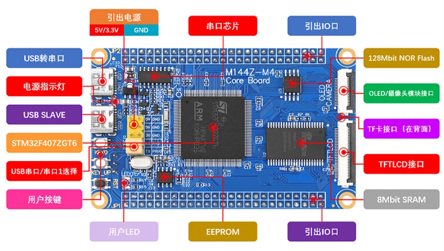

## M144Z-M4 core board

[Product document](http://www.openedv.com/docs/boards/xiaoxitongban/M144Z/M144Z-M4%20STM32F407.html)

The board used in this community contribution is the STM32F4DISCOVERY board from STM. The board can be purchased from various sources and should be about 20 euros. Further information on this board and links for the user and programming manuals can be found at the product page in ST [website](https://www.st.com/en/evaluation-tools/stm32f4discovery.html).

Some basic information abstracted from ST:

- STM32F407VGT6 microcontroller featuring 32-bit ARM®Cortex®-M4 with FPU core, 1-Mbyte Flash memory, 192-kbyte RAM in an LQFP100 package
- On-board ST-LINK/V2 on STM32F4DISCOVERY (old reference) or ST-LINK/V2-A on STM32F407G-DISC1 (new order code)
- USB ST-LINK with re-enumeration capability and three different interfaces:
  - Debug port
  - Virtual Com port (with new order code only)
  - Mass storage (with new order code only)
- Board power supply: through USB bus or from an external 5 V supply voltage
- External application power supply: 3 V and 5 V
- LIS302DL or LIS3DSH ST MEMS 3-axis accelerometer
- MP45DT02 ST-MEMS audio sensor omni-directional digital microphone
- CS43L22 audio DAC with integrated class D speaker driver
- Eight LEDs:
  - LD1 (red/green) for USB communication
  - LD2 (red) for 3.3 V power on
  - Four user LEDs, LD3 (orange), LD4 (green), LD5 (red) and LD6 (blue)
  - 2 USB OTG LEDs LD7 (green) VBUS and LD8 (red) over-current
- Two push-buttons (user and reset)
- USB OTG FS with micro-AB connector
- Extension header for all LQFP100 I/Os for quick connection to prototyping board and easy probing

## Flashing and debugging

This board has one mini USB connector exposing the embedded ST-Link interface that is used for flashing the nanoFramework firmware and for performing debugging on the nanoCLR code.
The second USB connector (a micro USB one) is used to connect the device with Visual Studio allowing to deploy and debug your C# managed applications.

## ADC configurations

The following ADC channels (and respective GPIO pins) are available to the managed API, in the respective index:

- PC1, ADC1 IN11
- PC2  ADC1 IN12
- PA6  ADC2 IN6
- PA7  ADC2 IN7
- PB0  ADC2 IN8
- Temp Sensor ADC1
- VrefInt ADC1
- Vbatt ADC1

## I2C configurations

I2C buses available:

- I2C1
  - SCL pin: GPIOB_8
  - SDA pin: GPIOB_9

## Floating point

The current build is set to add support for single-precision floating point.
Meaning that `System.Math` API supports only the `float` overloads. The `double` ones will throw a `NotImplementedException`.

## Firmware images (ready to deploy)

## Managed helpers

Checkout the [C# managed helpers](https://github.com/nanoframework/nf-Community-Targets/tree/main/ChibiOS/M144Z_M4/managed_helpers) available for this board.
